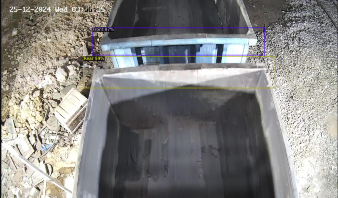

# Wagon Analysis and Damage Detection

## Overview
This project processes rail wagon videos to analyze their status. It determines whether a wagon is loaded or unloaded, calculates the volume of materials if loaded, and detects damages if unloaded. The output includes a report with volume calculations or damage detections along with captured images.

## Workflow

### Edge Detection & Wagon Counting
- Uses a custom-trained CNN model to detect the front and rear edges of wagons.
- Counts the number of wagons in the video.

<p float="left">
  
  
</p>

### Wagon Classification (Loaded/Unloaded)
- A trained CNN model classifies each wagon as either "Loaded" or "Unloaded."


### Volume Calculation (For Loaded Wagons)
- Utilizes DepthAnything Large (Hugging Face) for depth estimation.
- Calculates the volume of materials using depth maps and known wagon dimensions.
- Generates a PDF report with the volume details.


### Damage Detection (For Unloaded Wagons)
- A custom-trained CNN model detects damages such as cracks or debris.
- Saves images of damaged wagons along with their wagon numbers.
- Generates a PDF report with detected damage details and images.


<p float="left">
  
  
</p>

## Libraries & Dependencies
- **OpenCV** - For video processing and image manipulation.
- **Detectron2** - For object detection (front and rear edges of wagons).
- **TensorFlow/Keras** - For CNN models (wagon classification and damage detection).
- **Torch** - For handling deep learning models.
- **DepthAnything (Hugging Face)** - For depth estimation to calculate volume.
- **NumPy & Matplotlib** - For numerical operations and visualization.
- **ReportLab** - For generating PDFs with analysis results.

## Installation
```sh
pip install opencv-python torch torchvision detectron2 tensorflow numpy matplotlib reportlab
```

## Usage
Run cells in final.ipynb

## Output
### For Loaded Wagons:
- Prints and saves a PDF report with volume calculations.

### For Unloaded Wagons:
- Detects and saves images of damaged wagons.
- Generates a PDF report with wagon numbers and damage details.

## Authors
- Gnanendra Naidu N
- Aditya Ranjan
- Bhavya Mashru
- Vikas Sanchaniya
- Priyanshi Shah
